# NY OCM Practitioner List Job - Workflow Flowchart

```mermaid
flowchart LR
    A[Application Start] --> B[BatchApplication.main]
    B --> C[Spring Boot Context Initialization]
    C --> D[Load Configuration Properties]
    D --> E[Initialize DataSource Oracle DB]
    E --> F[Create Job Components]
    
    F --> G[JobOperator.start]
    G --> H[practitionerListExportJob]
    
    H --> I[Step 1: cleanOutputAreaStep]
    I --> J[CleanDirTasklet]
    J --> K[Create Output Directory]
    K --> L[Delete Existing Files]
    L --> M{Cleanup Successful?}
    
    M -->|Yes| N[Step 2: exportToCsvStep]
    M -->|No| O[Job Failed]
    
    N --> P[SqlFileReader]
    P --> Q[Load SQL from input.sql]
    Q --> R[Execute SQL Query on Oracle DB]
    R --> S[Fetch Practitioner Data]
    S --> T[Process in Chunks of 1000]
    
    T --> U[CsvWriter]
    U --> V[Generate CSV Files]
    V --> W[Write to Output Directory]
    W --> X{All Data Processed?}
    
    X -->|Yes| Y[Job Completed Successfully]
    X -->|No| T
    
    O --> Z[Send Error Email]
    Y --> AA[Job Execution Complete]
    Z --> AA
    
    subgraph "Database Query"
        R --> R1[SELECT practitioners with consent]
        R1 --> R2[JOIN address, phone, specialty, county]
        R2 --> R3[Format data for CSV output]
    end
    
    subgraph "Output Data"
        V --> V1[County, City, Name]
        V1 --> V2[Specialty, Address, State]
        V2 --> V3[ZIP, Phone Number]
    end
    
    style A fill:#e1f5fe
    style Y fill:#c8e6c9
    style O fill:#ffcdd2
    style Z fill:#ffcdd2
```

## Component Overview

- **BatchApplication**: Main Spring Boot application with CommandLineRunner
- **JobConfig**: Defines the Spring Batch job with two sequential steps
- **CleanDirTasklet**: Cleans output directory before processing
- **SqlFileReader**: Reads practitioner data from Oracle database using SQL file
- **CsvWriter**: Writes processed data to CSV format
- **DataSourceConfig**: Configures Oracle database connection
- **Error Handling**: Email notifications for failures via GeneralErrorEmailStrategy

## Data Flow

1. Application starts and initializes Spring context
2. Job executes two sequential steps:
   - **Clean Step**: Removes old output files
   - **Export Step**: Reads from database and writes to CSV
3. Data is processed in chunks of 1000 records
4. Final CSV contains practitioner information for public consumption
